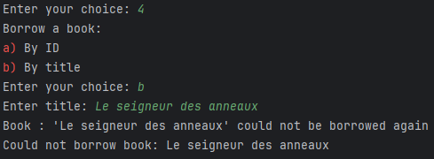

# SY43 TD 1 Kotlin Introduction

## Source code :

- Entire source code is available at : github.com/AntoinePerrin25/

- When starting the program, the menu appears and if you enter a wrong choice, it appears again :
## Adding books
- Let's first add 3 books, 2 with name "Harry Potter", but a slightly different author, and another one completely different :

## Searching by author and title

### By title :

### By author :

## Borrowing a book
- Let's try to borrow a book, and let's try to borrow it again

Successfully borrowed

Error, already borrowed

 

## Displaying available books

## Returning a book

## Exiting the program

